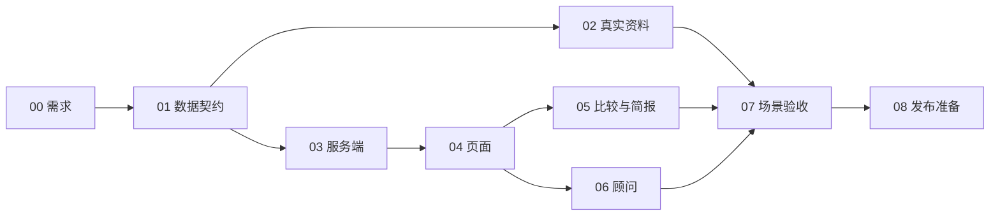

# 目标探索任务计划

日期：2026-09-26。依据：[SPEC](SPEC.md) 与 [目标探索需求](EXPLORATION_PRD.md)。

已完成 [GitHub 源码对照](EXPLORATION_GITHUB_REVIEW.md)，细化点纳入下列实施票。参考项目的测试通过只说明其相应机制可执行，不代表知向已实现或家庭验收已通过。

已完成 [58 条功能要求的精细对齐](EXPLORATION_ALIGNMENT.md)。PRD 0.4 对完整度、范围回退、定位保留、撤回收藏的顾问入口、简报模式说明和刷新时机作明确规定；各票依据以当前 PRD 为准。24 条部分对应、13 条冲突、21 条未验证均需知向自己的实现和验收。

本文件用于导航；执行票按仓库约定一票一文件保存在 `.scratch/exploration-first/issues/`，该目录不会提交。只有依赖全部 completed 才能开始，实际状态以票内记录为准。需求对照已经完成，按实施票持续推进。

当前状态：00、01、02、03、04、05、06 已完成。02在2026-09-27依据维护者收到逐项清单后的明确确认，导入首批9专业28条内容；原六条候选仍pending。07的真实家庭走查、08的完整发布要求仍待完成。数据字典、迁移与工具见 [学习证据契约](LEARNING_EVIDENCE.md)，实际路由见 [接口说明](API.md)，当前操作见 [使用指南](USER_GUIDE.md)。独立本机 PostgreSQL 下240项测试、构建、API十项断言和13项Chrome流程通过，覆盖比较/简报及顾问接入；2026-09-27另有9个正式学习完整条目、11项外网读取检查及导入幂等验证通过，见[部署记录](SERVER_DEPLOYMENT.md)。学生/家长走查、外部AI及完整产品验收未执行，不将首批内容发布等同全部交付。

## 执行顺序

| 编号 | 任务 | 优先级 | 依赖 | 主要交付 | 关联验收 |
| --- | --- | --- | --- | --- | --- |
| 00 | 需求定型与文档同步 | P0 | 无 | PRD、SPEC、任务票及一致性检查 | 本次文档交付 |
| 01 | 学习证据和选科范围的数据契约 | P0 | 00 | 逐事实定位、人工审核、条件类型、批次标识与迁移设计 | S03/S05/S10 |
| 02 | 首批真实专业资料与审核导入 | P0 | 01 | 至少两个完整条目、可定位的来源与审核记录、覆盖报告 | S02/S03/S06/S10 |
| 03 | 服务端探索清单、目录和专业详情 | P0 | 01 | 无评分探索路径、分页目录、稳定 ID、当前有效证据共享读取 | S01—S05/S07/S11 |
| 04 | 探索首屏、专业详情与收藏交互 | P0 | 03 | 默认探索、资料优先的页面与可靠操作状态 | S01/S03—S05/S07/S10/S12 |
| 05 | 专业比较与探索简报 | P0 | 03、04 | 2—3 专业比较、1—3 专业简报、模式与刷新正确、复制反馈 | S02/S06/S08/S11/S12 |
| 06 | 顾问专业焦点与学习证据解释 | P1 | 03、04 | 全审核池焦点、预填与本地降级 | S02/S04/S09 |
| 07 | 场景验收与真实家庭走查 | P0 | 02、04、05、06 | S01—S12 记录、学生/家长反馈、阻断项修复 | 全部场景 |
| 08 | 发布前环境、额度与恢复条件 | P1 | 07 | 新版预览、既有额度要求、数据/版本检查、恢复方案 | 发布门槛 |

02 与 03 在契约确定后可以分别推进，不要求等全国专业资料齐备。07 的内容验收必须使用审核通过的真实条目，不能只依赖测试替身。

## 实施票

- [00 需求定型](../.scratch/exploration-first/issues/00-requirements-and-plan.md)
- [01 数据契约](../.scratch/exploration-first/issues/01-learning-evidence-contract.md)
- [02 资料审核与导入](../.scratch/exploration-first/issues/02-reviewed-content.md)
- [03 服务端探索](../.scratch/exploration-first/issues/03-exploration-service.md)
- [04 探索页面](../.scratch/exploration-first/issues/04-exploration-ui.md)
- [05 比较与简报](../.scratch/exploration-first/issues/05-comparison-and-brief.md)
- [06 顾问](../.scratch/exploration-first/issues/06-advisor-exploration.md)
- [07 场景验收](../.scratch/exploration-first/issues/07-scenario-acceptance.md)
- [08 发布准备](../.scratch/exploration-first/issues/08-release-readiness.md)

以上执行票链接仅在当前工作区有效；克隆或交接时按表格与 PRD 重建票据，不能把忽略目录中的票据误认为随仓库分发。

## 验证要求

- 每票记录范围、通过/失败/未运行项、命令与证据；已有问题单独列出。
- 01/02：独立数据库中的幂等、校验、回退或指定批次撤回；不修改共享学生记录。
- 03：规则、资格范围、分页、ID 存在检查与无位次分支的 Vitest；API 契约同步 docs/API.md。
- 04/05/06：构建、相关交互测试；键盘与手机、空状态、重试、复制失败都有验收。
- 07：独立测试库完成 S01—S12；记录真实家庭反馈与尚未覆盖内容，不在共享生产库跑写入式测试。
- 08：先完成可审查预览和恢复方案，再在获得上线授权后发布。不得将旧 MySQL 学生档案自动上传到共享 Supabase，也不能直接在旧服务器拉 main 后重建容器。

## GitHub 对照后的实施细化

| 细化 | 执行票 | 验收要求 |
| --- | --- | --- |
| 每条事实有材料位置及人工审核记录 | 01、02、04、05 | 家庭能定位原文，待审核内容不进入有效事实 |
| 学习、课程先修、招生资格、职业准入分开 | 01、03、04、06 | 课程知识要求不触发高考资格过滤；单校要求不泛化 |
| 名称修订、资料撤回保持收藏 ID 与备注 | 01、03、04、07 | S07 增加改名及撤回回归，失效事实不继续引用 |
| 当前内容批次、源校验值及统一证据读取 | 01、02、03、05、06、07 | S09 更新材料后详情、简报和当轮顾问依据一致；不新增历史快照系统 |

## 优先级说明

P0 用于专业资料可信、探索闭环和场景验收；P1 用于增强顾问及发布准备。顾问即使没有外部 AI，也必须有本地解释，所以 06 仍是首期验收依赖。08 是公开部署的独立门槛，不以 P1 标记免除原有每日额度、密钥和数据库要求。

暂不安排新的测评、全国招生扩展或个人适合度算法。既有招生 PDF、历史版本与完整档案编辑问题继续留在 SPEC 待完善表，不在本期悄悄取消。
