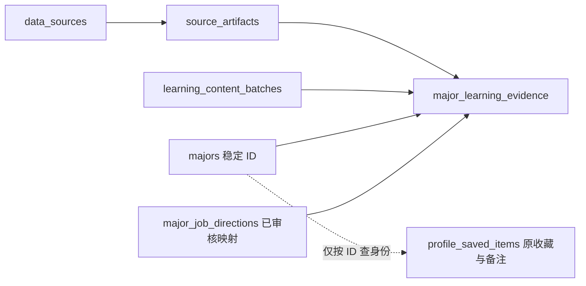

# 专业学习证据契约

本契约落实 [PRD 0.4](EXPLORATION_PRD.md) E02/E03。01 的结构/契约、02 的预检/导入/撤回工具、03 的当前证据读取/探索 API 以及04—06页面/比较/简报/顾问接入已实现并通过独立环境测试。2026-09-27，维护者收到具体审核清单后确认导入首批9专业28条内容，正式服务器读取链路已验证；家庭走查与完整产品验收按 [任务计划](EXPLORATION_TASKS.md) 继续推进。

2026-09-28 追加 [职业资格与选科补充批次](../data/learning-evidence/qualification-20260928/README.md)：7 条职业事实已发布，覆盖医师、护士、教师、特定法律职业和会计资格边界；大连医科大学河南 2026 年计划表的选科条件仅登记为待核验，不执行硬过滤。正式库原 28 条保持不变；新批次重复预检为 8 条 skipped。其余选科范围仍为未知，不能解释成不限。

## 表与复用关系

| 对象 | 用途与选择理由 |
| --- | --- |
| `majors` | 标准专业 ID、代码、名称、类别；改名只更新名称，不能重建 ID |
| `data_sources` | 复用发布方、材料标题、原 URL、材料年份、采集时间，不另建来源目录 |
| `source_artifacts` | 复用材料 ID、原始文件路径、SHA-256 和大小；保持官方页面原锚点 |
| `learning_content_batches` | 新增批次 ID、输入文件 SHA-256、激活/撤回状态；现有 `import_batches` 绑定招生导入统计，不混用 |
| `major_learning_evidence` | 新增逐事实内容、定位、范围、审核及条件；`major_outlook_evidence` 只用于发展信号，不能替代课程材料 |
| `major_job_directions` / `job_directions` | 复用职业身份与人工映射；新职业事实关联已有映射，不新建第二套方向分类 |
| `profile_saved_items` | 收藏和原始备注保持原表；证据撤回不更新或删除它，不引入问卷或家庭权重 |



事实只存 `artifact_id`，由材料关联 `data_sources`，避免将某材料和另一个来源错误组合。各外键使用默认 RESTRICT/NO ACTION，不级联删除专业、材料、职业映射或批次。收藏表不关联学习证据或批次。

## 数据字典

共享类型与 Zod 校验见 [learning-evidence-contract](../server/learning-evidence-contract.ts)；前端从 [api](../src/api.ts) 作类型导出，没有数据库或运行时服务端依赖。字段使用显式 null，不用空字符串、0 或默认“不限”表示未知。

| API/内部 DTO 字段 | 存储与语义 |
| --- | --- |
| `id` / `factKey` / `majorId` | 事实 UUID / 批次内稳定事实键 / 标准专业 ID；唯一键 `(batch_id,fact_key)`。同批次同事实更新时保留事实 ID，不用名称或内容散列替代专业身份 |
| `kind` / `content` | 事实类型 / 忠实原文的短摘要（1—2000 字） |
| `source.id` / `source.artifactId` | 来源 ID 与具体材料 UUID，由材料关联读取 |
| `source.title` / `url` / `year` / `publisher` | 原标题、HTTPS 材料 URL（保留 fragment）、材料年、发布方；材料年与招生年、生成时间分开 |
| `source.publisherType` | `education_authority`、`university`、`professional_authority`；由逐事实审核确认官方身份，枚举本身不能证明官方身份 |
| `source.sha256` / `collectedAt` | 原材料 SHA-256 / 采集时间；校验值不能代替人工审核 |
| `locator.kind` / `value` | `page` 页码、`section` 章节或 `anchor` 锚点及具体值；必填，不能只挂官网首页 |
| `scope.level` / `schoolId` | `major` 专业范围（学校 ID 必须为空）或 `school` 单校实例（必须有学校 ID） |
| `scope.province` / `subjectGroup` / `admissionYear` | 招生范围；招生资格事实三项均必填。其他事实可为空，但不能据此推导当前招生资格 |
| `condition` | 仅 `admission_requirement` 可带选科结构；其他事实必须为空 |
| `jobDirectionId` / `careerMappingStatus` | 职业方向 ID / 读取现有映射的 `pending/approved/rejected`。职业方向事实必须关联映射，且映射为 approved 才有效；职业准入可关联具体方向 |
| `review.status` | `pending/verified/conflicting/rejected/withdrawn`；verified 与既有审计“已核验”语义一致，职业映射仍使用原 approved 枚举 |
| `review.reviewer` / `reviewedAt` / `conclusion` / `reason` | 核验人、核验时间、结论及理由。非 pending 状态全部必填，结论须与状态一致；不从模型时间或链接可访问性自动产生 |
| `validUntil` | 可空；有明确有效期时到期变 expired，不能早于核验时间。没有有效期不表示招生跨年适用 |
| `batch.id` / `checksum` / `status` | 当前内容批次 UUID / 输入文件 SHA-256 / `staged/active/withdrawn`；源材料校验值另存，不混为内容版本 |

`LearningEvidence` 是关联读取后的 DTO，不是直接 INSERT 参数；后续导入需验证原文件真实散列、标准身份精确映射、来源关联及人工审核记录。类型不包含适合度、性格、家庭权重、招生分档或预测值。

## 事实类型与条件

| kind | 内容 | 能否用于高考选科过滤 |
| --- | --- | --- |
| `curriculum` | 课程、培养内容 | 否 |
| `learning_activity` | 实验、项目、实习等有来源的学习活动 | 否 |
| `learning_prerequisite` | 学习前置知识，如材料所述数学基础 | 否 |
| `course_prerequisite` | 大学课程之间的先修条件 | 否 |
| `admission_requirement` | 官方招生选科资格 | 仅当前精确适用范围的已核验事实 |
| `career_direction` | 经审核的专业—职业方向事实 | 否 |
| `career_requirement` | 读研、考证或职业准入门槛 | 否 |

选科条件为 `{type:'subjects',mode:'all'|'any'|'unrestricted',subjects:[...]}`。all 表示全部要求，any 表示任选一项；前两者列表必须非空且不重复。unrestricted 必须显式登记且列表为空。暂不支持的特殊资格保留待核验，不能解析成 unrestricted。

`evaluateAdmissionEvidence` 使用明确传入的招生年，绝不从系统当前年或材料年推断。学校 ID、省份、科类和招生年精确匹配；针对整个专业的调用传 `schoolId:null`，单校资格不参与专业级过滤。同范围出现不同结构要求或 conflicting 材料时返回 conflicting，不取有利的一条。等价但格式不同的材料可先保留冲突，由维护者确认，不自动合并。

`selectLearningMaterials` 对指定学校/材料年不作回退。缺当前范围返回 missing；其他有效范围材料在 `otherInstances` 中保留真实学校与年份，由调用方明确标为其他实例。

## 审核、失效与完整度

审核须人工检查官方发布身份、标准专业映射、摘要原意、定位、范围和条件类型，并登记核验人、时间、结论与理由。生成内容、用户备注、招聘样本、HTTP 成功和模型日期均不能替代这一操作。测试替身只在 `tests/fixtures/` 和独立库使用，不移入正式 `data/`。

`evidenceAvailability` 先校验完整契约。未激活批次、未来核验/采集时间、待审核映射不发布；冲突、拒绝、撤回、到期及无效结构均不返回 verified。有效职业方向还须现有映射为 approved。缺失为无事实，不建立占位“已核验”行。

完整度按有效课程/培养事实、学习活动、不同职业方向分别计数，三者各至少一项才为 complete。未知选科、职业门槛和学校例子另外披露，不补值满足完整度。完整度函数由调用方传入单一专业的当前证据集合。

撤回批次仅改变该批次状态、撤回时间与理由；逐事实撤回改变其审核状态及相应结论和理由。撤回后不再作为有效事实，专业身份、收藏和原备注保留。冲突材料用于披露具体冲突，不作为确定性课程/职业结论。

03 已提供 [统一证据读取](../server/learning-evidence-repository.ts) 和 [探索服务](../server/major-exploration.ts)：每次请求重新读取当前批次、材料 ID、散列和审核状态，非有效原文不作为事实输出。详情、目录与首屏已接入；比较、简报及顾问后续复用，不能缓存旧助手回答作为事实，不承诺历史快照或实时推送。实际端点见 [API](API.md)。

## 迁移与恢复

新增结构已纳入 `database/schema.sql`。已有库的独立增量文件为 [001-learning-evidence.sql](../database/migrations/001-learning-evidence.sql)，二者内容一致。使用仓库已有 pg/SQL 维护方式，没有引入 Supabase CLI、Docker 或生产执行入口。

1. 对明确选定的数据库备份，并保存应用版本与事实/批次清单；正式库本次未执行迁移。
2. 在独立测试库验证后，通过 `psql` 或现有参数化 pg 连接，以事务执行增量文件。不为执行增量迁移重跑正式库种子或初始化。
3. 重复执行只创建缺少的对象，不清理、重命名或更新旧表及旧行。新增两表启用 RLS，撤销 PUBLIC、anon 和 authenticated 的表权限；浏览器仍经 Express 访问，不新增家庭账号隔离。
4. 出现问题可先回退应用代码，保留新增表；旧应用不依赖它们。事实恢复使用重新审核的明确批次，不盲目将所有 withdrawn 改回 active。
5. 需要撤回某次正式内容时，用下方工具按准确批次 UUID 更新 `learning_content_batches` 的 status、withdrawn_at、withdrawal_reason，并核对受影响行数与其他批次状态。**不 DELETE 专业、材料、职业映射、收藏或档案。**

数据库保证身份外键、批次内唯一键、非空定位、审核必要字段、条件类型隔离和范围结构；共享 Zod 校验补充 URL、散列、选科去重、长度及跨字段校验。直接 SQL 维护不代表通过了应用校验或人工审核；统一读取须再校验 DTO 才能发布。

## 02 导入工具

[导入实现](../server/learning-evidence-import.ts) 与 CLI 要求显式通过私密环境注入 `LEARNING_IMPORT_DATABASE_URL`。不自动读 `.env`，不使用 DATABASE_URL/POSTGRES_URL，也不接受连接串命令参数。工具不会采集网络数据或写学生档案。

输入为 `{version:1,batchId,status:'staged'|'active',sources,records}`。来源登记 key/title/url/year/publisher/publisherType/collectedAt/localPath/sha256；事实登记 factKey/majorCode/kind/content/sourceKey/locator/scope/review/validUntil/jobDirectionCode/condition。scope 使用明确学校全名代替数据库 ID，工具精确匹配标准专业代码、学校名及已有职业映射。缺失或多义不猜 ID、不新建标准专业、不提升职业审核状态。

原件 localPath 必须相对清单所在目录，真实路径也须留在该目录内（禁止链接跳出）；单文件非空且至多20MB，清单至多2MB。输入和每份原件都核对真实 SHA-256。URL 保留锚点；已有同 URL/年份的来源标题/发布方不同则报冲突，不盲目覆盖。

```powershell
# 私密环境已经明确指定独立测试库后，从仓库根目录执行。
$learningInputSha = (Get-FileHash -LiteralPath '<审核清单.json>' -Algorithm SHA256).Hash.ToLower()
npm run data:learning-evidence -- '<审核清单.json>' --sha256 $learningInputSha
# 审核和预检通过、目标库明确后才显式写入。
npm run data:learning-evidence -- '<审核清单.json>' --sha256 $learningInputSha --commit
npm run data:learning-evidence:withdraw -- '<准确批次UUID>' --reason '具体撤回理由'
```

默认预检只 SELECT，不写来源、材料、批次或事实。报告包含 total/inserted/updated/skipped/missing/anomalous、逐行状态、批次/来源错误及课程/活动/职业/选科/学校实例覆盖；缺失/异常时退出失败，不会借 `--commit` 强写。提交在事务中重新核对输入、原件和映射，失败完整回滚。同批次同文件重跑只计 skipped。

仅 staged 批次可用 `--previous-sha256 <原输入SHA256>` 显式替换：必须完整保留原 factKey 集合和专业、类型、范围身份，保留事实 UUID。审核补全后可激活；active/withdrawn 批次不接受不同内容，撤回批次不自动重激活。已发布内容修订使用新批次并准确撤回旧批次，不扩建历史快照。

原件/清单在 `.scratch` 的候选、AI 摘录和空人工核验字段不会自动变 verified。正式材料需实际维护者按逐项来源、定位、范围及映射填写审核记录，确认可保存使用后整理到正式输入。工具实现阶段没有正式内容导入或生产迁移；后续已获明确确认的导入见下。

### 2026-09-27 首批正式内容

[正式清单及11份原件](../data/learning-evidence/initial-20260927/README.md)覆盖9个专业、28条事实（课程9、活动9、职业方向9、历史升学/培训说明1）。逐项审核清单提供后，项目维护者在对话确认“没问题直接导”，登记该实际确认身份、时间和理由，不虚构个人姓名或逐页访问记录。批次`883ebf2e-97b9-4d23-9915-deaaf12d766a`，输入SHA256 `2ca7a150b1d46c40bfc9cd761812334750d5433b982ab21e840302aeba00ccc5`。

显式目标服务器库预检无异常、9条目完整，提交新增28，重跑跳过28；详情逐一对照正文、学校、材料年、位置与散列。来源限定学校及师范/临床护理等方向，材料年2024—2026，不代表当前招生资格或全国统一课程。未新增招生选科条件，职业准入仍按实证披露未知。准确批次撤回沿用既有CLI，不删除档案、收藏或原件。完整报告见[部署记录](SERVER_DEPLOYMENT.md)。

## 验证

`tests/learning-evidence-contract.test.ts` 覆盖审核、URL/定位保留、失效、完整度、条件隔离、未知/不限、单校范围、冲突与缺范围不回退。

`tests/learning-evidence-postgres.test.ts` 必须显式提供 `EXPLORATION_TEST_DATABASE_URL`；只接受 loopback 和 `zhixiang_exploration_test` 或其测试后缀库名。不读 `.env`、DATABASE_URL 或应用回退。测试事务模拟旧结构/收藏，重复迁移、再次初始化、约束失败、改名及精确批次撤回，并检查 RLS 和客户端权限。所有合成行及 DDL 在 finally 回滚；日常 npm test 未提供专用地址时明确 skipped，不计为数据库通过。
